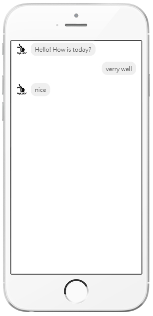

# IPHONE_SIMULATION_VIEW

Demo message:

1.Custome Content:

        <iphone-simulation-view>
        
<h1>Hello</h1>

        </iphone-simulation-view>

2.Message : 

        <iphone-simulation-view contentType="message" :messagesData="messagesData"></iphone-simulation-view>

        messagesData:
        [
                {
                user: "manager",
                text:
                    "Hello",
                img:
                    "url..."
                },
                { user: "customer", text: "Hello", img: "" }
        ]

